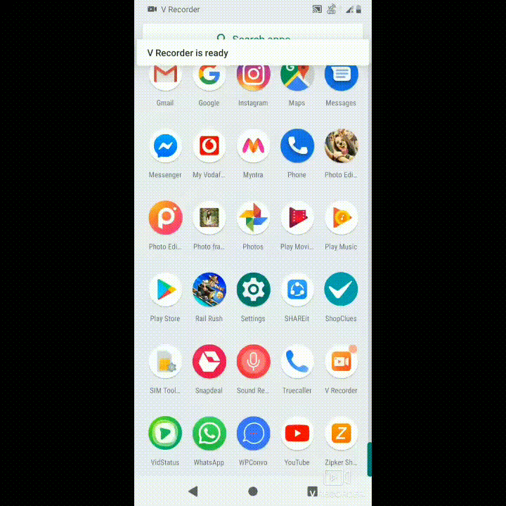

# WPConvo

### Too lazy to save a contact?
WPConvo provides you the easiest way to start conversation or send messages on whatsapp to an unsaved contact in your phonebook. Just follow three simple steps:
1. Select your country code.
2. Enter the valid phone number.
3. Enter a message (optional) and send.

#### Note: This app is build upon an existing API 'Click to chat' provided by Whatsapp.
